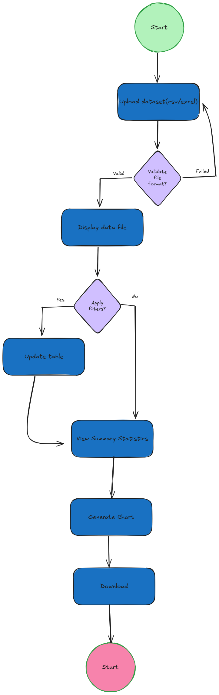

# DataTracker-Dataset-Visualizer-App
DataTracker is a simple and intuitive web app that lets users upload CSV or Excel files and quickly explore their data. It shows a clean preview of the dataset, allows filtering, provides basic statistics, and generates interactive charts. It’s designed to make early-stage data analysis faster and easier, even for non-experts.

